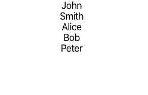

# Import Export Exercise for react

This application should print out a list of name given by `namesData.js`.

Currently the application is not working due to missing import and export statements. Your goal is to fix the application to get it working again.
